# Mathematica在金融领域的一些应用

* 从MySQL读取数据
* 金融绘图
* 一个简单的回测实现

BackTest.wls 

下载数据

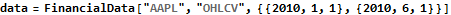

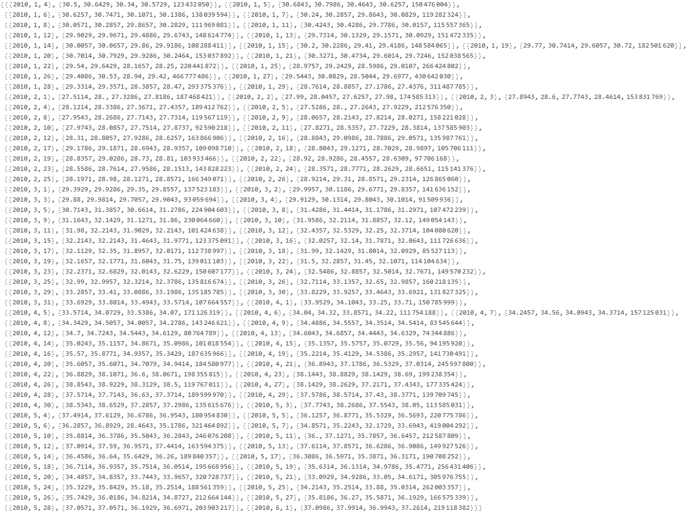

取收盘价

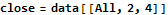

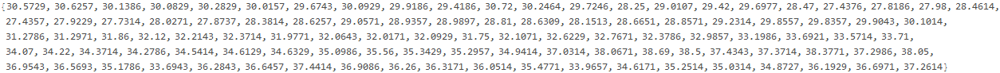

指数移动平均线

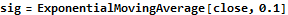

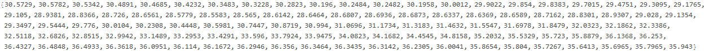

收盘价与平均线图

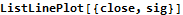

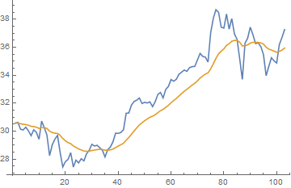

交易信号

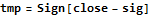

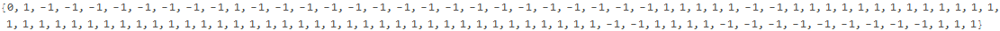

买点

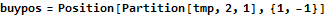

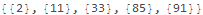

卖点

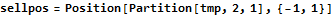

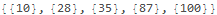

策略

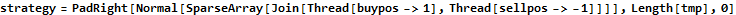

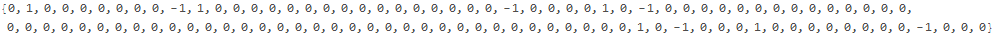

回测并提交报告

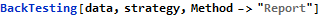

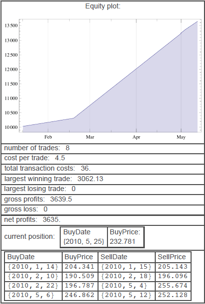

[Created with the Wolfram Language](http://www.wolfram.com/language/)